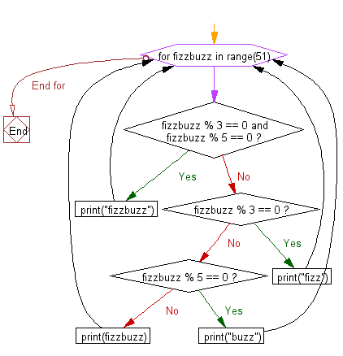

<!-- ---
layout: page
title: Session 1 Recap
order: 9
session: 2
length: 30
toc: true
adapted: false
--- -->

# Session 1 Recap

## A quick recap:

- Variables, assignment, basic data types, `print()`
- Data structures - lists and dictionaries
- Control flow - `if`, `elif` & `else`
- Loops - `for`, `range()`


## Quiz

Which of these lines is *not* valid Python?

1. 
```python
my_name='Werner Brandes'
```

2. 
```python
first_name = 'Werner', last_name = 'Brandes'
```

3. 
```python
first_name, last_name = 'Werner', 'Brandes'
```

4. 
```python
my_name = ('Werner', 'Brandes')
```


What will be printed?

```python
line = 'Mary'
for word in ['had', 'a', 'little', 'lamb']:
    line += word
print(line)
```

1. 
```txt
Mary
```

2. 
```txt
had a little lamb
```

3. 
```txt
Maryhadalittlelamb
```


Which of these programs will print

```txt
This is the malt that lay in the house that Jack built
```

1. 
```python
jack, jill = True, False
if jack and jill:
    print('Jack and Jill went up the hill')
else:
    print('This is the malt that lay in the house that Jack built')
```

2. 
```python
jack, jill = True, False
if jill:
    print('This is the malt that lay in the house that Jack built')
elif jack:
    print('This is the house that Jack built')
```


## Exercise

This is a famous (and now overused) programming task used in interviews.

"Write a program that prints the numbers from 1 to 50. But for multiples of
three print “Fizz” instead of the number and for the multiples of five print
“Buzz”. For numbers which are multiples of both three and five print
“FizzBuzz”."
 
Give it a go!

## Hint 1
In Python, the modulo operator is `%`. This returns the remainder when 
dividing one number by another.

~~~python
print(10 % 5)
~~~

~~~txt
0
~~~

~~~python
print(10 % 3)
~~~

~~~txt
1
~~~

## Hint 2
Here is the control flow for the fizzbuzz problem. Note that the iterator variable is not called `i` in this flowchart (it is called `fizzbuzz`.)
 


## Solution 1
~~~python
for i in range(1, 51):
    if i % 3 == 0 and i % 5 == 0:
        print("fizzbuzz")
    elif i % 3 == 0:
        print("fizz")
    elif i % 5 == 0:
        print("buzz")
    else:
        print(i)
~~~

## Solution 2
~~~python
for i in range(1, 51):
    s = ''
    if not i % 3:
        s += 'fizz'
    if not i % 5:
        s += 'buzz'
    if not s:
        s = i
    print(s)
~~~


### References

<https://en.wikipedia.org/wiki/This_Is_the_House_That_Jack_Built>