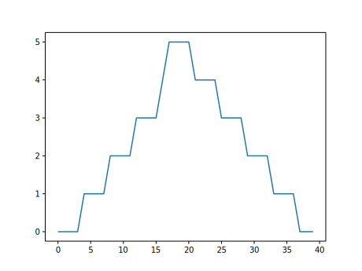

<!-- ---
layout: page
title: Data Analysis Task 2
order: 13
session: 2
length: 30
toc: true
--- -->

# Data Analysis Task 2

## Learning Objectives

In this lesson, we will:

- Plot simple graphs from data.
- Plot multiple graphs in a single figure.

## Visualizing data

Visualization is a huge topic, but we can explore a few features of Python's `matplotlib` library here.  

There is no official Python plotting library, however `matplotlib` is the _de facto_ standard.  

First import the `pyplot` module from `matplotlib`

~~~python
import matplotlib.pyplot as plt
image = plt.imshow(data)
plt.show()
~~~

We can see that the general number of inflammation flare-ups
for the patients rises and falls over a 40-day period.

So far so good as this is in line with our knowledge of the clinical trial and Dr. Maverick's
claims:

* the patients take their medication once their inflammation flare-ups begin
* it takes around 3 weeks for the medication to take effect and begin reducing flare-ups
* and flare-ups appear to drop to zero by the end of the clinical trial.

Now let's take a look at the average inflammation over time:

~~~python
ave_inflammation = np.mean(data, axis=0)
ave_plot = plt.plot(ave_inflammation)
plt.show()
~~~

Here, we have put the average inflammation per day across all patients in the variable
`ave_inflammation`, then asked `matplotlib.pyplot` to create and display a line graph of those
values.  

The result is a reasonably linear rise and fall, in line with Dr. Maverick's claim that
the medication takes 3 weeks to take effect.  But a good data scientist doesn't just consider the
average of a dataset, so let's have a look at two other statistics:

~~~python
max_plot = plt.plot(np.max(data, axis=0))
plt.show()
~~~

~~~python
min_plot = plt.plot(np.min(data, axis=0))
plt.show()
~~~

The maximum value rises and falls linearly, while the minimum seems to be a step function.
Neither trend seems particularly likely, so either there's a mistake in our calculations or
something is wrong with our data. This insight would have been difficult to reach by examining
the numbers themselves without visualization tools.

### Grouping plots

You can group similar plots in a single figure using subplots.
This script below uses a number of new commands. 

Each subplot is stored in a
different variable (`axes1`, `axes2`, `axes3`). Once a subplot is created, the axes can
be titled using the `set_xlabel()` command (or `set_ylabel()`).

~~~python
import numpy
import matplotlib.pyplot as plt

data = np.loadtxt(fname='data/inflammation-01.csv', delimiter=',')

fig = plt.figure(figsize=(10.0, 3.0))

axes1 = fig.add_subplot(1, 3, 1)
axes2 = fig.add_subplot(1, 3, 2)
axes3 = fig.add_subplot(1, 3, 3)

axes1.set_ylabel('average')
axes1.plot(np.mean(data, axis=0))

axes2.set_ylabel('max')
axes2.plot(np.max(data, axis=0))

axes3.set_ylabel('min')
axes3.plot(np.min(data, axis=0))

fig.tight_layout()

plt.savefig('inflammation.png')
plt.show()
~~~

Here are our three plots side by side:

The call to `loadtxt` reads our data,
and the rest of the program tells the plotting library
how large we want the figure to be,
that we're creating three subplots,
what to draw for each one,
and that we want a tight layout.
(If we leave out that call to `fig.tight_layout()`,
the graphs will actually be squeezed together more closely.)

## Importing libraries with shortcuts

We used `import matplotlib.pyplot` to import the `pyplot` module of `matplotlib`. 

However, shortcuts such as `import matplotlib.pyplot as plt` are frequently used.

Importing `pyplot` this way means that after the initial import, rather than writing
`matplotlib.pyplot.plot(...)`, you can now write `plt.plot(...)`.

Another common convention is to use the shortcut `import numpy as np` when importing the
NumPy library. We then can write `np.loadtxt(...)` instead of `np.loadtxt(...)`,
for example.

## Drawing Straight Lines

In the center and right subplots above, we expect all lines to look like step functions because
non-integer value are not realistic for the minimum and maximum values. However, you can see
that the lines are not always vertical or horizontal, and in particular the step function
n the subplot on the right looks slanted.

Matplotlib interpolates (draws a straight line) between the points.

To avoid this we can use the Matplotlib `drawstyle` option:

~~~python
import numpy as np
import matplotlib.pyplot as plt

data = np.loadtxt(fname='data/inflammation-01.csv', delimiter=',')

fig = plt.figure(figsize=(10.0, 3.0))

axes1 = fig.add_subplot(1, 3, 1)
axes2 = fig.add_subplot(1, 3, 2)
axes3 = fig.add_subplot(1, 3, 3)

axes1.set_ylabel('average')
axes1.plot(np.mean(data, axis=0), drawstyle='steps-mid')

axes2.set_ylabel('max')
axes2.plot(np.max(data, axis=0), drawstyle='steps-mid')

axes3.set_ylabel('min')
axes3.plot(np.min(data, axis=0), drawstyle='steps-mid')

fig.tight_layout()

plt.show()
~~~

## Exercise 

### Make Your Own Plot

Create a plot showing the standard deviation (`np.std`)
of the inflammation data for each day across all patients.

## Solution

~~~python
std_plot = plt.plot(np.std(data, axis=0))
plt.show()
~~~

## Moving Plots Around

Modify the program to display the three plots on top of one another
instead of side by side.

## Solution

~~~python
import numpy as np
import matplotlib.pyplot as plt

data = np.loadtxt(fname='data/inflammation-01.csv', delimiter=',')

# change figsize (swap width and height)
fig = plt.figure(figsize=(3.0, 10.0))

# change add_subplot (swap first two parameters)
axes1 = fig.add_subplot(3, 1, 1)
axes2 = fig.add_subplot(3, 1, 2)
axes3 = fig.add_subplot(3, 1, 3)

axes1.set_ylabel('average')
axes1.plot(np.mean(data, axis=0))

axes2.set_ylabel('max')
axes2.plot(np.max(data, axis=0))

axes3.set_ylabel('min')
axes3.plot(np.min(data, axis=0))

fig.tight_layout()

plt.show()
~~~
