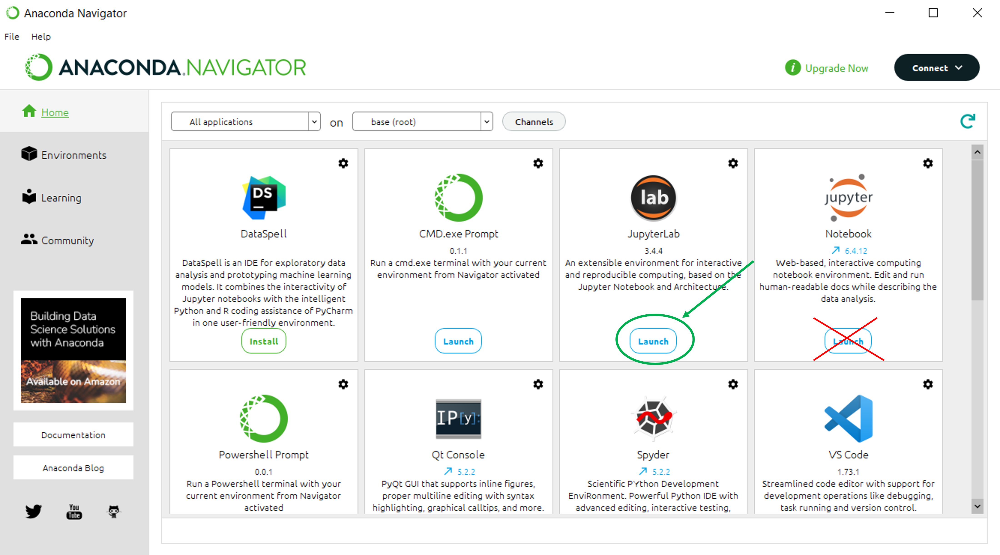
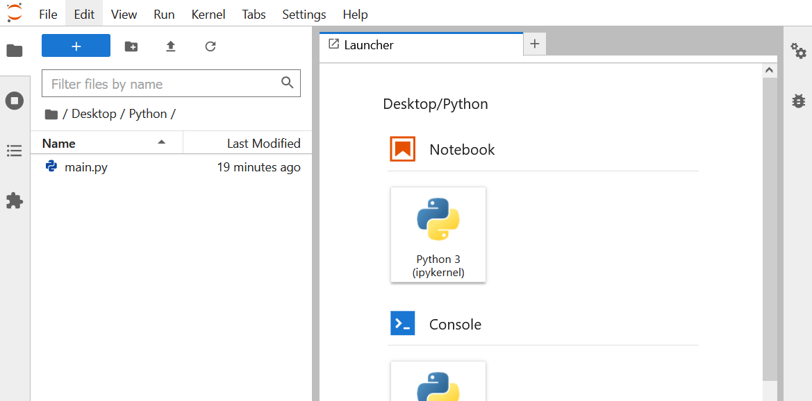

## Introduction

For this course, attendees will need to install the programming language Python,
and an editor, where we can type commands, and run our programs. We will also
need an up-to-date web browser: we recommend a current version of Chrome,
Safari, or Firefox.

Python, and also various editors, are included in the all-in-one installer
called [Anaconda](https://www.anaconda.com/products/distribution). This makes it
easy to install Python and various scientific add-ons, without having to know
too much about programming before starting out.

The Software Carpentries have created some excellent guides for installing
Anaconda. [These can be found
here](https://c
arpentries.github.io/workshop-template/#python), along with video
tutorials for each operating system. Please follow the relevant installation
guide for your operating system (macOS, Windows, or Linux).

Further installation instructions can be found on the Anaconda web-pages
[here](https://docs.conda.io/projects/conda/en/latest/user-guide/install/index.html#regular-installation).
These are a bit more in-depth!

In the first session we will use the JupyterLab editor that is included with
anaconda. We will work in a notebook within this editor. Below are instructions
on how to start this editor up.

In the second session we will explore using scripts. This can be done in
JupyterLab, but we recommend using a code editor and shell. For this we recommend the
popular editor VisualStudio Code (VSCode). This includes easy aces to a shell.
Details are below.


### JupyterLab

JupyterLab is a user interface for editing python files and notebooks. It runs
in your web browser.

On windows it can be opened by starting "Anaconda Navigator", then selecting
"JupyterLab". This is different from selecting "Notebook".



This should launch a web browser and open a tab for JupyterLab. The title of the
tab will be JupyterLab. It will look like:



Once you are here you are ready for the first session.


You can also launch JupyterLab from the command line. Open the Anaconda
PowerShell (or other shell from python) and run
> jupyter lab


### VisualStudio Code

VSCode is a popular editor created by Microsoft. It has a large collection of
extensions to help editing various programming languages. One of the languages
that is well supported is Python. 

You can download VSCode from
[code.visualstudio.com](https://code.visualstudio.com/). There is a tutorial on
how to setup python with VSCode at
[python-tutorial](https://code.visualstudio.com/docs/python/python-tutorial).

TO check that you have everything installed and ready open VSCode. Then open a
terminal in VSCode (Terminal -> 'New Terminal'). Then ```python --version```, if you
see something like 
> Python 3...
Then everything is ready.

## Help!

Please have a go at installing Anaconda yourself. If you are struggling, we will
be holding an online drop-in on the Monday before the first session. An email
link will be made available to you once your registration on the course has been
confirmed.

### FAQ

- My browser isn't showing anything and I cannot change browser!
  - From
    [StackOverflow](https://stackoverflow.com/questions/47772157/how-to-change-the-default-browser-used-by-jupyter-notebook-in-windows)
    the basic answer is to create a config file and specify the browser.
    A config file can be created with
    > jupyter notebook --generate-config
    Then the ```c.NotebookApp.browser``` and ```c.ServerApp.browser``` options can be set to the appropriate browser.

- What is the difference between JupyterLab and a Jupyter Notebook?
  - JupyterLab is an editor (or integrated development environment, IDE) which
    can be used to create and edit Notebooks and Scripts.
  - A notebook is a particular format of script that allows code and text blocks
    to be interwoven. The code blocks can be executed in line to show their
    answers. This is a helpful format for explaining,demonstrating and exploring
    methods.
